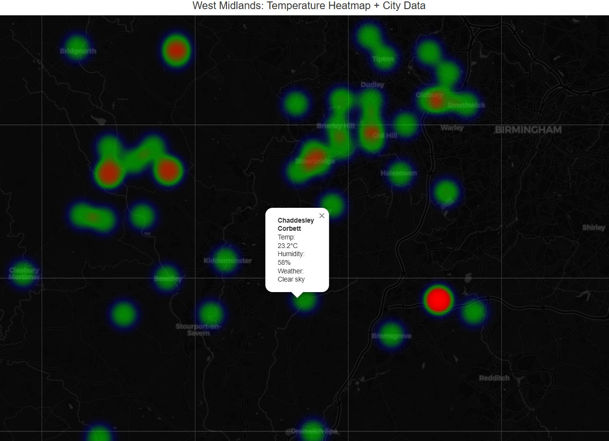

# Weather Map Generator

Create beautiful, interactive weather heatmaps using real-time data from the OpenWeatherMap API. This Python application generates interactive HTML maps showing temperature data as heatmaps with clickable markers for detailed weather information.




## Features

- 🌡️ **Real-time Weather Data**: Fetches current weather data from OpenWeatherMap API
- 🗺️ **Interactive Heatmaps**: Generates beautiful temperature heatmaps using Folium
- 📍 **Clickable Markers**: Each location has interactive markers with detailed weather info
- 💾 **Data Caching**: Option to cache weather data locally to reduce API calls
- 🎨 **Customizable**: Dark theme maps with customizable gradients and styling
- 🧪 **Well Tested**: Comprehensive test suite with high coverage
- 🐛 **Debug Mode**: Built-in debugging for development and troubleshooting

## Demo

The generated maps include:
- Temperature heatmap overlay with color gradients (blue → lime → red)
- Interactive markers showing detailed weather information
- Popup windows with temperature, humidity, and weather descriptions
- Responsive design that works on desktop and mobile

## Installation

### Prerequisites

- Python 3.12+
- OpenWeatherMap API key (free at [openweathermap.org](https://openweathermap.org/api))

### Setup

1. **Clone the repository**
   ```bash
   git clone https://github.com/boxops/weathermap_generator.git
   cd weathermap_generator
   ```

2. **Install dependencies with Poetry (recommended)**
   ```bash
   poetry install
   poetry shell
   ```

3. **Set up environment variables**
   
   Create a `.env` file in the project root:
   ```bash
   OPENWEATHERMAP_API_KEY=your_api_key_here
   ```

## Quick Start

### Basic Usage

```python
from src.weather_map import WeatherMapApp

# Create weather map for Birmingham, UK area
weather_map = WeatherMapApp(
    data_file="weather.json",
    latitude="52.4862",      # Birmingham coordinates
    longitude="-1.8904",
    fresh_data=True,         # Fetch fresh data from API
    debug=True              # Enable debug output
)

# Generate interactive heatmap
weather_map.create_interactive_heatmap("birmingham_weather.html")
```

### Command Line Usage

Run the application directly:

```bash
python src/weather_map.py
```

This will generate an `interactive_heatmap.html` file with weather data for the West Midlands area.

## Configuration

### WeatherMapApp Parameters

| Parameter | Type | Default | Description |
|-----------|------|---------|-------------|
| `data_file` | str | Required | Path to JSON file for caching weather data |
| `latitude` | str | Required | Latitude for weather data center point |
| `longitude` | str | Required | Longitude for weather data center point |
| `fresh_data` | bool | `False` | If `True`, fetches fresh data from API. If `False`, uses cached data |
| `debug` | bool | `False` | Enable debug output for troubleshooting |

### Example Locations

```python
# London, UK
WeatherMapApp("london.json", "51.5074", "-0.1278", fresh_data=True)

# New York, USA  
WeatherMapApp("nyc.json", "40.7128", "-74.0060", fresh_data=True)

# Tokyo, Japan
WeatherMapApp("tokyo.json", "35.6762", "139.6503", fresh_data=True)
```

## API Reference

### WeatherDataFetcher

Handles fetching and caching weather data from OpenWeatherMap API.

```python
fetcher = WeatherDataFetcher(
    file="weather.json",
    latitude="52.4862",
    longitude="-1.8904",
    fresh_data=True,
    debug=False
)
data = fetcher.fetch_data()
```

### InteractiveHeatmap

Creates interactive Folium maps with heatmap layers and markers.

```python
heatmap = InteractiveHeatmap(data_fetcher, debug=False)
heatmap.run("output.html")  # Creates complete interactive map
```

## Development

### Running Tests

```bash
# Run all tests
pytest

# Run with coverage
pytest --cov=src --cov-report=html

# Run specific test file
pytest tests/test_weather_data_fetcher.py -v
```

### Project Structure

```
weathermap_generator/
├── src/
│   ├── __init__.py
│   ├── weather_map.py          # Main application code
│   └── weather.json            # Cached weather data
├── tests/
│   ├── __init__.py
│   ├── conftest.py            # Test fixtures
│   ├── test_weather_data_fetcher.py
│   └── test_interactive_heatmap.py
├── htmlcov/                   # Coverage reports
├── .env                       # Environment variables
├── pyproject.toml            # Poetry dependencies
└── README.md
```

### Contributing

1. Fork the repository
2. Create a feature branch (`git checkout -b feature/amazing-feature`)
3. Make your changes
4. Add tests for new functionality
5. Ensure tests pass (`pytest`)
6. Commit your changes (`git commit -m 'Add amazing feature'`)
7. Push to the branch (`git push origin feature/amazing-feature`)
8. Open a Pull Request

## Dependencies

- **folium**: Interactive maps and visualizations
- **requests**: HTTP requests to OpenWeatherMap API
- **python-dotenv**: Environment variable management
- **pytest**: Testing framework
- **pytest-mock**: Mocking for tests
- **pytest-cov**: Coverage reporting

## License

This project is licensed under the Apache 2.0 License - see the [LICENSE](LICENSE) file for details.

## Acknowledgments

- [OpenWeatherMap](https://openweathermap.org/) for providing the weather data API
- [Folium](https://python-visualization.github.io/folium/) for the interactive mapping capabilities
- [Leaflet.js](https://leafletjs.com/) (used by Folium) for the underlying map functionality

## Support

If you encounter any issues or have questions:

1. Check the [Issues](https://github.com/boxops/weathermap_generator/issues) page
2. Create a new issue with detailed information about your problem
3. Include your Python version, OS, and error messages

## Changelog

### v0.1.0
- Initial release
- Basic weather data fetching from OpenWeatherMap API
- Interactive heatmap generation with Folium
- Comprehensive test suite
- Documentation and examples
